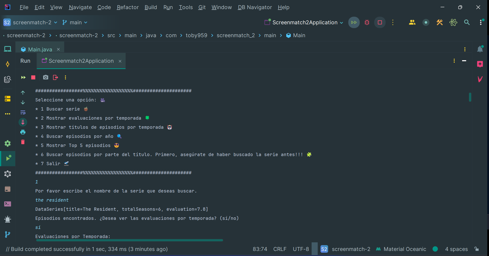
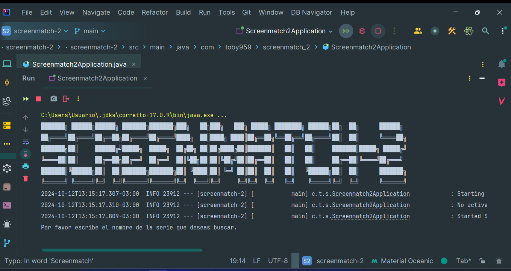
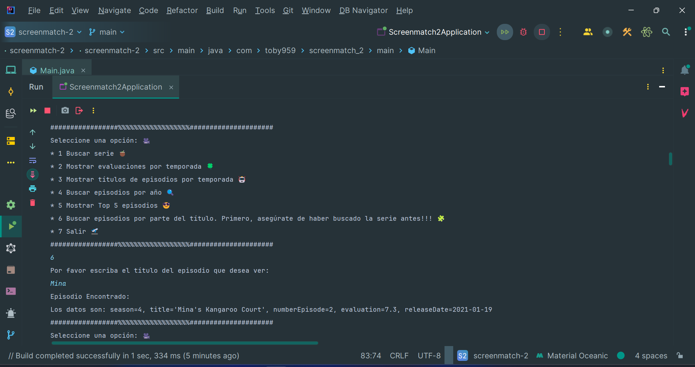
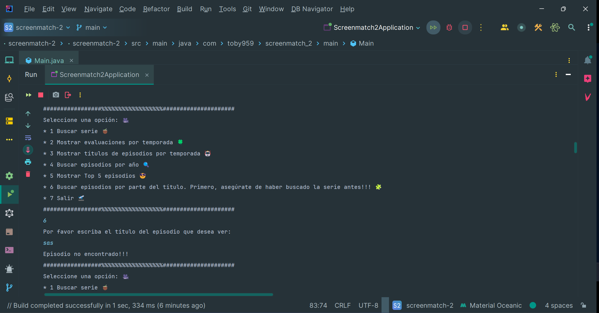

 <h1 aling="center"> Api Screenmatch_2 🎬 </h1>


&nbsp;&nbsp;&nbsp;&nbsp;&nbsp;&nbsp;&nbsp;&nbsp;&nbsp;[](LICENSE)&nbsp;&nbsp;&nbsp;

# Descripción 📖
Este proyecto es una API de Películas que permite realizar consultas por consola sobre títulos. Proporciona el título;
el año de lanzamiento; evaluacion de los puntajes y la duración de las películas. Utiliza la  **OMDb API** para obtener la información de las   
películas junto con sus respectivos datos. Puedes encontrar más información sobre esta API en su [web](https://www.omdbapi.com/)
___ 

# Recursos:

| Plugin           | URL                                                                            |
|------------------|--------------------------------------------------------------------------------|
| jackson-databind | https://mvnrepository.com/artifact/com.fasterxml.jackson.core/jackson-databind |
| dotenv          | https://mvnrepository.com/artifact/io.github.cdimascio/dotenv-java | 
___
# Herramientas utilizadas 🛠️
* 1 - IntelliJ IDEA Community Edition: Un entorno de desarrollo integrado (IDE) para Java que facilita la programación.
* 2 - Java versión 17.0.10: La versión del lenguaje de programación Java utilizada en este proyecto.
* 3 - dotenv-java: Una biblioteca de Java que permite cargar variables de entorno desde un archivo .env en tu proyecto.
* 4 - jackson-databind: es un componente esencial de la biblioteca Jackson, que se utiliza para convertir entre JSON y objetos Java (POJOs).
* 5 - Scanner: Una herramienta fundamental en Java para la entrada de datos por consola, lo que permite interactuar con el usuario de manera efectiva.
* 6 - URLEncoder: Convierte caracteres especiales y espacios en un formato seguro para URLs.
* 7 - stream(): introducida en Java 8, proporciona una forma eficiente y funcional de procesar colecciones de datos.
* 8 - map(): en Java Stream API es una operación intermedia que se utiliza para transformar los elementos de un flujo (stream) de un tipo a otro.
* 9 - filter(): en Java Streams es una operación intermedia que permite seleccionar elementos de un flujo (stream) que cumplen con una condición específica definida por un Predicate.
* 10 - flatMap(): en Java Stream API es una operación intermedia que se utiliza para transformar y aplanar los elementos de un flujo (stream) de un tipo en otro, permitiendo manejar estructuras de datos más complejas, como listas de listas.
* 11 - peek(): se utiliza principalmente en el contexto de las streams (flujos) para realizar operaciones intermedias. Permite inspeccionar los elementos de un flujo sin modificarlo.
* 12 - find(): se utiliza para buscar subsecuencias en una cadena de texto que coincidan con un patrón definido por una expresión regular. Este método es parte de la clase Matcher, que se utiliza en combinación con la clase Pattern para trabajar con expresiones regulares.
* 13 - collect(): en Java Stream API es una operación terminal que se utiliza para transformar los elementos de un flujo (stream) en una colección, como una lista, conjunto o mapa.
* 14 - java.time: proporciona una API moderna y mejorada para trabajar con fechas y horas, introducida en Java 8.
* 15 - DoubleSummaryStatistics: es una clase en Java que se utiliza para recopilar estadísticas sobre un flujo de valores de tipo double. Introducida en Java 8, permite calcular de manera eficiente el conteo, la suma, el promedio, el valor mínimo y el máximo de un conjunto de datos.
* 16 - Math.round(): en Java se utiliza para redondear un número al entero más cercano.
* 17 - Optional(): introducida en Java 8, es una herramienta diseñada para manejar la ausencia de valores de manera más segura y evitar excepciones de puntero nulo (NullPointerException).
* 18 - Lambda -> introducida en Java 8, son una característica que permite representar funciones anónimas de manera concisa. Estas expresiones son especialmente útiles para trabajar con colecciones y facilitar la programación funcional en Java. 
___


# Ejecutar el Proyecto ⚙️
1 - Clona el repositorio en tu máquina local
``` bash
git clone
<https://github.com/toby959/screenmatch_2.git>
```
2 - Compila y ejecuta el archivo MainWithSearch.java.
___

# Funcionalidades 📦
#### La API de OMDb es pública y de fácil acceso; se trata de un servicio web de tipo RESTful:
```bash
"http://www.omdbapi.com/?t="
```
#### En nuestro proyecto, se muestran los datos de las series: "Título"; "Total de Temporadas"; "Evaluaciones"; "Buscar titulos por frase"; "Puntuacion por temporada"; "Puntuacion media"; "Puntuacion por episodio mejor evaluado"; "Puntuacion por episodio peor evaluado". 
#### Interfaz de Usuario: Ofrece una interfaz simple y amigable basada en la consola.
#### Cuenta con más de 280.000 pósters, es una herramienta gratuita y de fácil acceso que permite obtener información detallada sobre películas y series.
#### Debes registrarte para obtener la API KEY:
```bash
http://www.omdbapi.com/?apikey=[APIKEY]& 
```
___   


___
# Colaboraciones 🎯
Si deseas contribuir a este proyecto, por favor sigue estos pasos:

1 - Haz un fork del repositorio: Crea una copia del repositorio en tu cuenta de GitHub.  
2 - Crea una nueva rama: Utiliza el siguiente comando para crear y cambiar a una nueva rama:
```bash
git chechout -b feature-nueva
```
3 - Realiza tus cambios: Implementa las mejoras o funcionalidades que deseas agregar.  
4 - Haz un commit de tus cambios: Guarda tus cambios con un mensaje descriptivo:
```bash 
git commit -m 'Añadir nueva funcionalidad'
```
5 - Envía tus cambios: Sube tu rama al repositorio remoto:
````bash
git push origin feature-nueva
````
6 - Abre un pull request: Dirígete a la página del repositorio original y crea un pull request para que revisemos tus cambios.

Gracias por tu interés en contribuir a este proyecto. ¡Esperamos tus aportes!
___
# Imagenes:









## Licencia 📜

Este proyecto está licenciado bajo la Licencia MIT - ver el archivo [LICENSE](https://github.com/toby959/screenmatch_2/blob/main/LICENSE) para más detalles.
